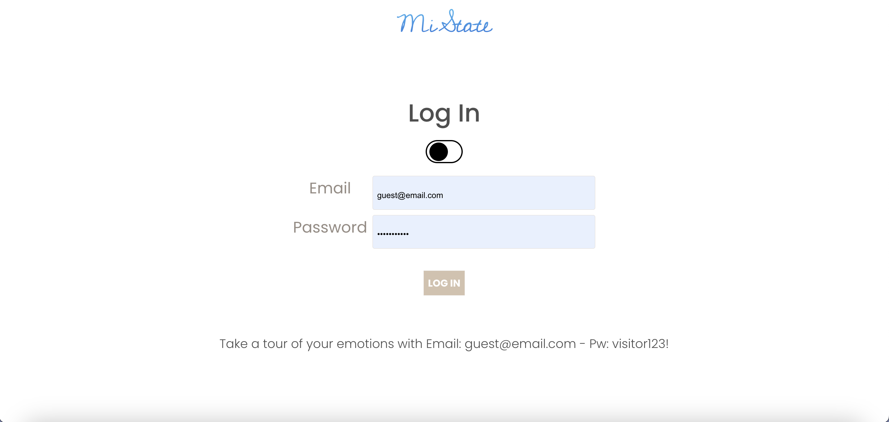

  # <u>MiState</u>

  ### [Start your Journey in self reflection](http://codemonk-wars.herokuapp.com/)

  ## Description:

  MiState is an app that encourages mindfulness and utilizes full MERN infrastructures to not only log the emotional state of the user but, also dynamically organize and render entries in an easy to read format. Each user has the opportunity to look back at logs to see progress/trends!  Your state is tracked on the front end, while on the back end we track the state of the app using the full MERN stack.

   ## Screenshots:
<h3 align="center">Auth Page</h3>
 
<h3 align="center">Homepage</h3>
 
<h3 align="center">My Week</h3>
 
 
<h3 align="center">New Entry</h3>

## :computer: Technologies Used

 

## Getting Started

 #### [Project planning and wireframing](https://trello.com/b/ParGbIjE/project-3)

 1.) Create an account to enjoy the app's functionality. 
 2.) Create your first entry to start logging and tracking your days! 
 3.) Look back, store, or start each week fresh 
 4.) Enjoy your own personal journal!

## Icebox Features:
* Add a feature to dynamically render a graph showing trends users state.
* Impliment geo location to access an average mood rating of other users logging THEIR state